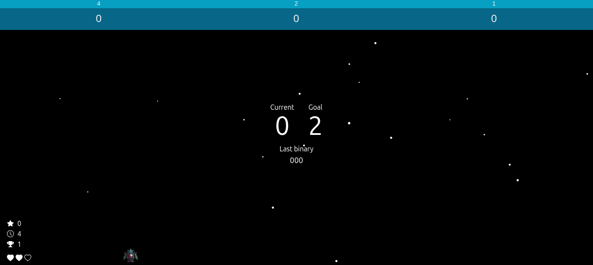

# Bitfire

> Game where you pilot a small ship and tweak binary blocks by shooting them. Each shot flips the digit between 0 and 1. Your goal is to build the sequence that matches the decimal number shown for the level.

## Assets

- Sounds effects: https://hunteraudio.itch.io/8bit-sfx-and-music-pack
- Spaceship images: https://foozlecc.itch.io/void-fleet-pack-2

## Technologies

- Vite
- React.js
- Tailwind CSS
- Sonner
- Canvas
- react-icons

## Play it

To play Bitfire, go to https://bitfiregame.vercel.app/

## License

This project is under license. See the file [LICENSE](LICENSE.md) for more details.